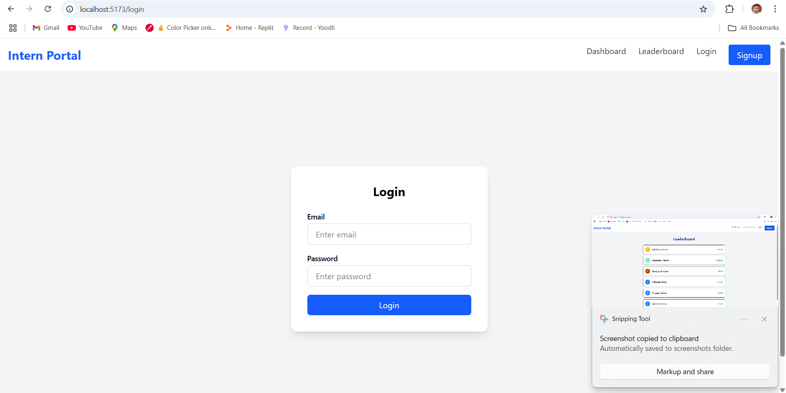
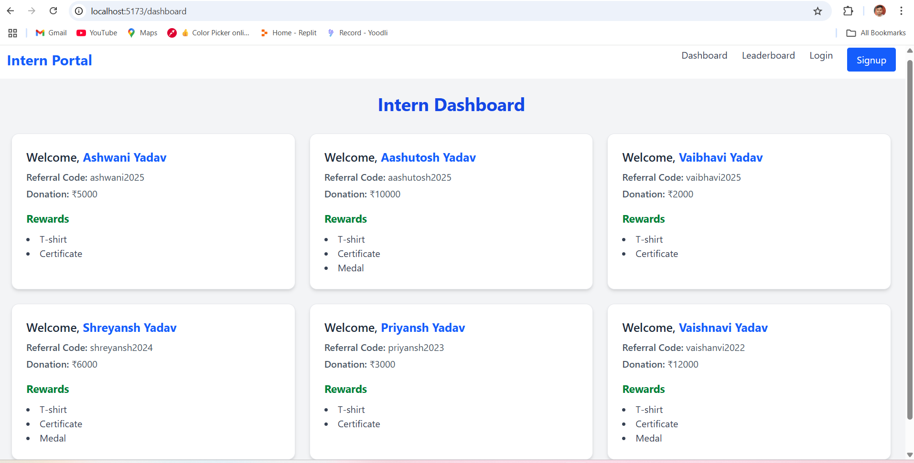
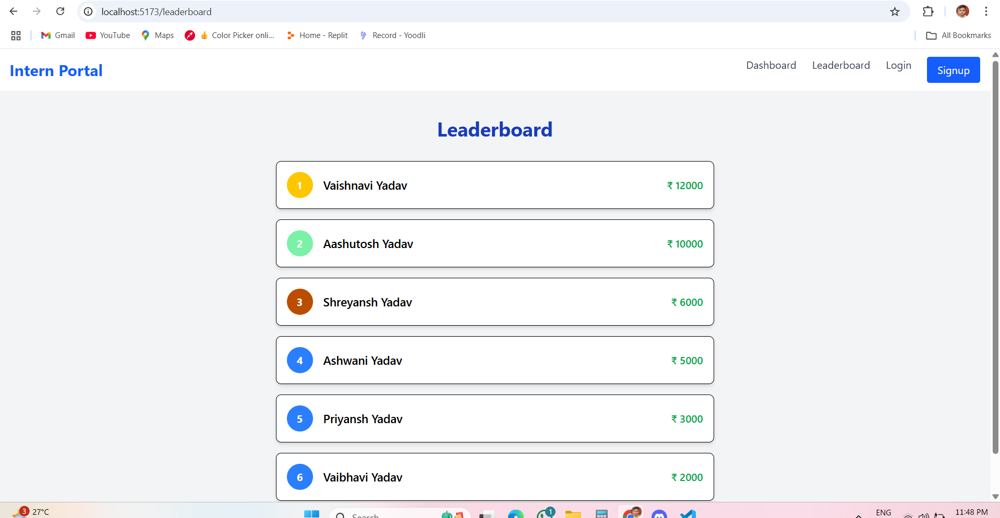

 Intern Portal (Full Stack)

A simple intern portal built with the MERN stack. Features include:
- Login / Signup
- Dashboard with name, referral code, rewards, donations
- Leaderboard with sorting
- Protected routes

## 📸 Screenshots

### Login Page


### Dashboard


### Leaderboard


---

## 🛠 Tech Stack

- **Frontend**: React + Tailwind CSS (inside `frontend/`)
- **Backend**: Node.js + Express  (inside `backend/`)
- 

---

## 🚀 Local Setup Instructions

### 1. Clone the Repository

```bash
git clone https://github.com/your-username/intern-portal.git
cd intern-portal

2. Setup Backend
bash
Copy
Edit
cd backend
npm install
# Create a .env file
touch .env
Add your environment variables in .env: PORT

Start the backend:
nodemon index.js or node index.js

. Setup Frontend
bash
Copy
Edit
cd ../frontend
npm install
npm run dev

